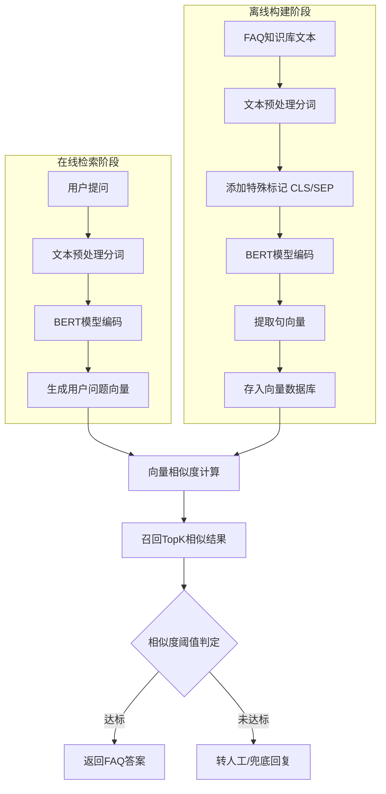

作业2（400字文档， 流程图）: 如何使用bert 进行文本编码，并且使用bert 进行相似度计算，需要写清楚技术方案；

目标是将用户输入问题与FAQ问题进行语义匹配，并返回最相似的答案。

1、在文本编码环节，首先对FAQ知识库中的标准问与相似问进行预处理，通过分词器将其转换为Token序列，并添加[CLS]与[SEP]特殊标记以适配BERT输入结构。

2、利用预训练的BERT模型对Token序列进行深层语义提取，通常取[CLS]位置的输出向量或对最后一层隐藏状态进行Mean Pooling操作，从而生成固定维度的句向量。

3、离线阶段，将生成的海量FAQ句向量存入向量数据库（如Milvus）并建立索引。

4、在线相似度计算阶段，用户提问经相同的BERT编码流程转化为向量，系统随即在向量库中通过计算余弦相似度或向量内积进行最近邻搜索，召回相似度最高的Top-K候选问题。

5、根据业务阈值判定最佳匹配项并返回对应答案，实现高效的语义匹配问答。

